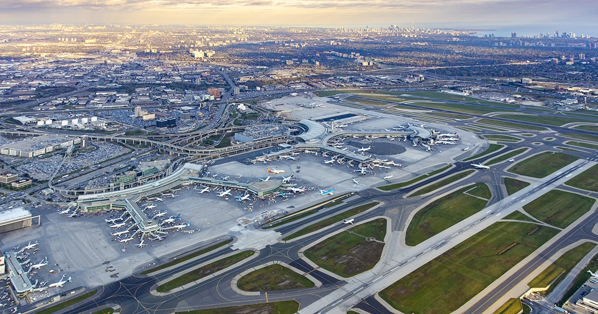
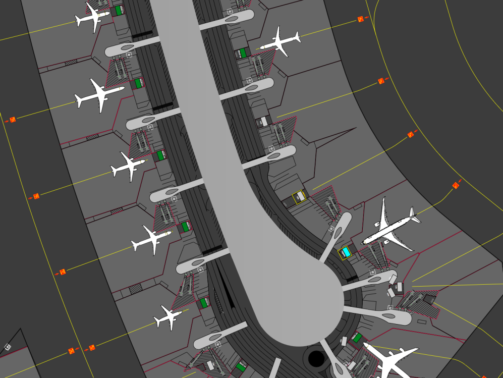
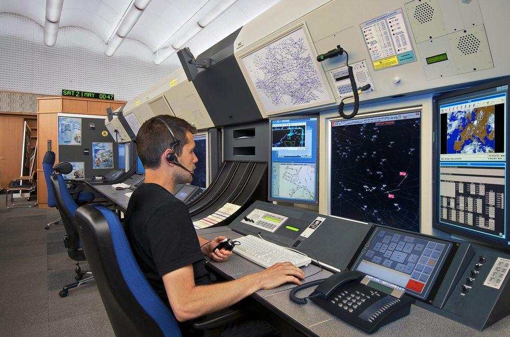
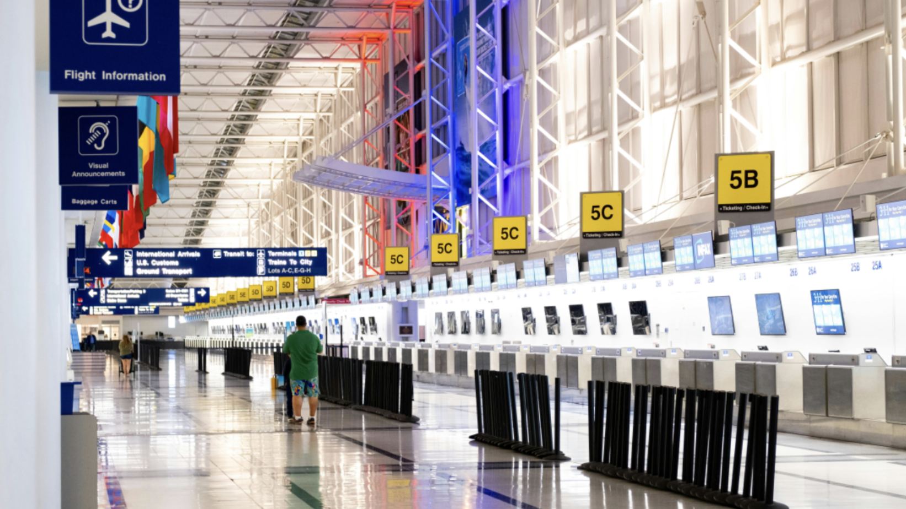

# Brock Solutions Airport Automation Challenge

Created by: Engineering IDEAs Clinic Co-op Students

## Quick Links

---

# Your Mission

Modern airports rely on many connected software systems to keep passengers, aircraft, baggage, and staff moving safely and efficiently. Brock Solutions works with airport clients to integrate systems that support real-world airport operations.

In this challenge, your team has been invited to prototype a software or software-adjacent solution for an airport automation problem. Your solution should be realistic enough to connect to airport operations, but focused enough to prototype during the challenge.

The airport of interest is Toronto Pearson International Airport (YYZ). Your solutions can center around problems faced by them.

You are encouraged to think like an airport systems engineer: handle messy data, think about safety and reliability, consider real operational constraints, and design something that could eventually integrate into a larger airport system.

You will be evaluated against the rubric at the bottom of this page. Your solution can be any combination of the subproblems below or even a new idea. Whatever you build, the judges will evaluate you against the rubric, so build with that in mind.

---

# Airport Systems Orientation

Before choosing a subproblem, you should understand a few airport system concepts.

## BHS (Baggage Handling System)

A Baggage Handling System tracks, routes, diverts, and sorts bags through conveyors, scanners, carousels, and make-up areas. These systems must be reliable because one wrong routing decision can delay a passenger, flight, or entire baggage pier.

## DCS (Departure Control System)

A Departure Control System manages passenger check-in, boarding, flight closeout, and aircraft readiness data. DCS-style messages may include flight numbers, aircraft types, departure stations, arrival stations, passenger/cargo context, and timing updates.

## GMS (Gate Management System)

A Gate Management System helps airports assign aircraft to gates while considering gate availability, aircraft size, passenger convenience, international/domestic rules, cargo restrictions, and disruptions such as delays or outages.

## ATC (Air Traffic Control)

An Air Traffic Control system manages the safe separation and sequencing of aircraft through taxiways, runways, and airspace sectors. ATC data includes aircraft callsigns, positions, altitudes, flight plan routes, speed and heading instructions, and handoff messages between sectors. 

## Message-Driven Airport Operations

Airport systems often communicate through message streams. In a real airport, this may involve queues, event streams, or integration middleware. For this challenge, some subproblems may provide simplified JSON messages or simulator data so that you can focus on the logic of your solution.

BHS, DCS, GMS, and ATC are all message driven operations that exist as peer systems, working together and exchanging messages with each other to maintain safe and reliable operation at airports.

---

# Subproblems

## 1. Baggage Handling System

Brock Solutions develops an array of software solutions for airports known as the SmartSuite. One of the primary focuses of the SmartSuite is tracking and processing huge volumes of baggage every day through networks of conveyors, scanners, diverters, and carousels. A harmonized system that manages these parts is known as a Baggage Handling System (BHS).

Your challenge is to design a BHS that can identify, track, route baggage through a simplified baggage handling environment, and detect anomalies or foreign objects on conveyor systems to ensure operational safety.

Potential solution directions:

* Barcode, RFID, or simulated tag-based bag identification
* Real-time bag state tracking dashboard
* Routing logic for conveyors and carousels
* Error handling for unreadable, oversized, overweight, fragile, or untagged bags
* Foreign object or anomaly detection on conveyor tracks
* Zone-based detection alerts for baggage systems
* Emergency stop, slowdown, or warning signals for conveyor operations
* Simulation of bag movement through a simplified conveyor network
* Privacy-conscious tracking that avoids unnecessary passenger personal information

Your solution may be software-only, hardware-assisted, simulation-based, or a mix of all three.

---

## 2. Gate Management System

Airports must dynamically assign gates to aircraft while balancing efficiency, passenger experience, safety, airline preferences, and unpredictable disruptions.

Your challenge is to design a system that assigns airport gates to arriving and departing flights over time.

Your solution should:

* Respect aircraft-gate compatibility
* Avoid gate occupancy conflicts
* Handle domestic, international, cargo, and security constraints
* Adapt to delays, gate outages, emergencies, and cascading schedule changes
* Minimize delays, reassignments, passenger walking distance, and wasted gate time

This is the primary coding-focused subproblem. Teams will write their logic in `solution.py`, and their solution will be evaluated against visible and hidden test scenarios.

Learn more: [gate-assignment/README.md](gate-assignment/README.md)

---

## 3. [Air Traffic Control System](air-traffic-control/README.md)

Modern Air Traffic Control systems maintain a live operational picture of aircraft moving through controlled airspace. Controllers do not rely on a single perfect source of truth. Instead, ATC automation software receives surveillance reports, flight-plan updates, route information, altitude and speed reports, weather constraints, and controller inputs. These data sources may be noisy, delayed, incomplete, or occasionally contradictory.

This subproblem is a simplified version of that real-world software challenge.

You are given a stream of simulated aircraft messages. Some messages report position, altitude, speed, and heading. Others report waypoints, estimated arrival times, or route updates. Messages may arrive late, contain noise, or conflict with previous information. The goal is to reconstruct the most likely aircraft route, estimate the aircraft’s current state, predict the next waypoint and ETA, and flag inconsistent or suspicious messages.

In real ATC systems, this general class of problem appears in surveillance data processing, flight data processing, trajectory prediction, safety-net monitoring, and controller display systems. This hackathon version focuses on the core software ideas behind those systems:

Potential solution directions:

This subproblem emphasizes state management, data interpretation, estimation, filtering noise for messages, considering the physics of the flight, etc.

---

## 4. [Departure Control System](departure-control-system/README.md)

A Departure Control System (DCS) runs the departure side of an airline operation: check-in, identity and document verification, baggage acceptance, boarding pass issuance, boarding control, and weight and balance (load control).

Your challenge is to pick a piece of the DCS pipeline - check-in, identity/document verification, baggage tracking, load balancing, boarding control, or the dashboard tying it together - and build a real solution to it. Narrow and complete beats broad and shallow.

Two implemented examples are included to show expected scope and depth:

* **[Unified Identity Gateway](departure-control-system/unified-identity-gateway/)** - identity verification, document checks, and boarding pass issuance as a single check-in flow
* **[Load Control](departure-control-system/load-control/)** - a MILP-based weight-and-balance optimizer that assigns cargo and passenger load to aircraft zones to hit a target center of gravity within structural limits

---

# Provided Materials

Depending on the subproblem, you may be given:

* Starter Python code
* Example JSON messages
* Flight schedule and airport layout data
* Demo scripts
* Sample solution files
* Evaluator scripts
* Simulator documentation
* Reference resources and academic papers

Do not assume the visible sample data covers every case. Final evaluation may include additional layouts, disruptions, corrupted data, and edge cases.

---

# Recommended Development Approach

1. Understand the airport operation you are modeling.
2. Build a simple working solution first.
3. Add validation and error handling.
4. Test obvious edge cases.
5. Test unrealistic but possible edge cases.
6. Optimize only after the solution is correct.
7.	Innovate! Add interesting and unique ideas that you have, if you find that the original problem is too easy.
8. Prepare a clear explanation of your design decisions.

A simple, reliable, well-explained prototype is better than a complex system that only works on the sample input.

---

# Submission

Teams will present a short 3–5 minute explanation of their solution to the judging panel.

Your presentation should include:

* The problem you chose
* Your system design
* Your prototype or simulation
* Key constraints you considered
* Edge cases you handled
* What you would improve with more time

Your prototype may be:

* Code
* A dashboard
* A simulation
* A hardware/software demonstration
* A design with partial implementation
* Any combination of the above

---

# Judging Criteria

You will be evaluated on the following categories.

### Ideation

| Category      | What Judges Are Looking For                             | Score |
| ------------- | --------------------------------------------------------- | ----- |
| Relevance     | How relevant is the solution to the problem space?         | /3    |
| Reasonability | How reasonable is the solution?                            | /3    |
| Impact        | How positively does the idea impact stakeholders?           | /3    |

### Feasibility

| Category     | What Judges Are Looking For                                                  | Score |
| ------------- | ----------------------------------------------------------------------------- | ----- |
| Cost          | Is the cost to build and run the solution realistic?                          | /3    |
| ROI           | Can productivity be increased greatly by building the solution? Is it worth the cost? | /3 |
| Practicality  | Can this be integrated in a factory setting?                                   | /3    |
| Reliability   | Does this solution have low downtime?                                          | /3    |

### Prototype Execution

| Category                | What Judges Are Looking For                                | Score |
| ------------------------ | ------------------------------------------------------------ | ----- |
| Functionality            | At time of judging, how functional is the prototype?         | /8    |
| Quality of Manufacturing | At time of judging, how well manufactured is the prototype?  | /3    |

### Safety & Regulations

| Category                     | What Judges Are Looking For                                                                  | Score |
| ----------------------------- | ----------------------------------------------------------------------------------------------- | ----- |
| Employee / Operator Safety   | Does the design account for risks to workers/users (ergonomics, exposure, radiation safety)?    | /3    |
| Regulatory Awareness          | Has the team identified relevant Canadian regulations (Canadian Air Transport Security Authority (CATSA) etc.)? | /3 |

### Demo/Pitch/Presentation

| Category | What Judges Are Looking For                                                                                    | Score |
| -------- | ------------------------------------------------------------------------------------------------------------- | ----- |
| Clarity  | How clear was the presentation in terms of explanation?                                                        | /5    |
| Depth    | Was the extent of the team's knowledge thoroughly expressed?                                                   | /5    |
| Demo     | How well designed was the demonstration - was it an impactful way to demonstrate what they tried to accomplish? | /5   |

For coding subproblems, hidden test cases may be used to evaluate whether your solution generalizes beyond the sample data.

---

# Resources

Suggested resource areas:

* Airport systems integration
* Baggage Handling Systems
* Departure Control Systems
* Gate Management Systems
* Airport common-use systems
* Message queues and event-driven software
* Optimization algorithms
* Simulation and visualization tools

Useful Python libraries may include:

* `numpy`
* `pandas`
* `matplotlib`
* `scipy`
* `networkx`
* `simpy`
* `pulp`

You may use other tools if they are appropriate for your solution.

---

# Final Note

This challenge is not only about building the most complete prototype. It is about showing that you can think through a real operational system, identify constraints, make tradeoffs, and design something that could eventually scale into an airport environment.
