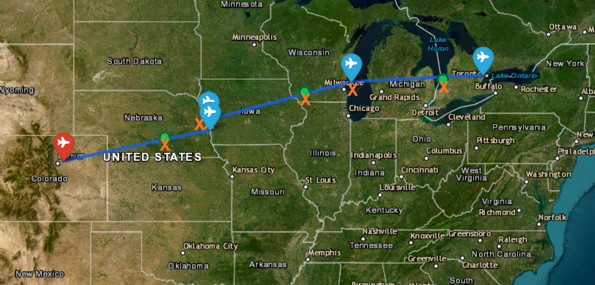

# Air Traffic Control System



Aircraft do not always send perfect updates. This challenge asks you to turn delayed, incomplete, noisy, or contradictory flight messages into a useful estimate of where an aircraft is now and where it is going next.

You do not need aviation experience to begin. The starter kit provides a working tracker, sample messages, a simulator, advanced examples, and a visual map. You can extend this system or build another solution that consumes the same messages.

## Table of Contents

- [Challenge](#challenge)
  - [Industry Context](#industry-context)
  - [Regulatory and Safety Context](#regulatory-and-safety-context)
  - [Inputs](#inputs)
  - [Expected Outputs](#expected-outputs)
- [Potential Solutions](#potential-solutions)
  - [Basic Solution Path](#basic-solution-path)
  - [State Estimation](#state-estimation)
  - [Multi-Hypothesis Routing](#multi-hypothesis-routing)
  - [Anomaly Detection](#anomaly-detection)
  - [Path Planning](#path-planning)
  - [Visualization](#visualization)
- [Getting Started](#getting-started)
- [Evaluation](#evaluation)
- [Resources](#resources)

## Challenge

Air traffic control automation combines surveillance reports, flight plans, route updates, and controller inputs to maintain a best estimate of each aircraft. The information can arrive from different systems, at different times, and with different levels of reliability.

Your system should help answer these questions:

- Where is the aircraft most likely to be right now?
- How uncertain is that estimate?
- Which route best explains the messages received so far?
- Which waypoint is the aircraft heading toward?
- When is it expected to arrive?
- Did a new message confirm, modify, or contradict the current route?
- Is a message suspicious enough to require review?

The supplied scenarios space messages farther apart than a normal live surveillance feed. This makes prediction, uncertainty, delayed information, and route reconstruction easier to explore.

### Industry Context

Operational air traffic systems do more than display the last reported position. Systems such as NAV CANADA's surveillance and flight-data platforms, the FAA's ERAM and STARS systems, and EUROCONTROL's ARTAS tracker combine several imperfect sources into a continuously updated picture of the aircraft and its likely trajectory.

That same pattern appears in autonomous vehicles, robotics, weather tracking, and space-object tracking: predict what should happen, compare that prediction with new observations, update the estimate, and communicate how confident the system is.

Reliable flight information also supports other airport operations. Gate planning, baggage handling, ground crews, and departure systems all make better decisions when arrival estimates and route information can be trusted.

| Challenge concept | Industry analogue |
| --- | --- |
| Message parsing | Normalizing surveillance and flight messages from different sources |
| Route reconstruction | Flight-data processing and trajectory management |
| Dead reckoning | Predicting a track between surveillance updates |
| State estimation | Combining a prediction with new measurements |
| Multi-hypothesis routing | Managing several plausible tracks or route explanations |
| Innovation monitoring | Comparing an observation with what the tracker predicted |
| ETA prediction | Predicting the aircraft's future trajectory and arrival time |
| Map visualization | Supporting controller and airport-operations displays |

This challenge models the tracking and reasoning ideas behind those systems. It does not reproduce a certified controller tool or provide real aircraft-separation services.

### Regulatory and Safety Context

Air traffic systems are safety-critical. A production system must follow operating rules, separation standards, safety-management processes, and software-assurance practices that go far beyond a hackathon prototype.

The challenge is set in Canada, so the Canadian material is the most relevant starting point. International and FAA references are included because air navigation systems must exchange information across regions and many tracking concepts are shared.

| Regulation or standard | What it covers | Connection to this challenge |
| --- | --- | --- |
| [Canadian Aviation Regulations, Part VIII](https://tc.canada.ca/en/corporate-services/acts-regulations/list-regulations/canadian-aviation-regulations-sor-96-433) | Canadian air navigation services, including air traffic services and safety management | Explains why operational tracking software needs controlled procedures, validation, and evidence that it behaves safely |
| [Standard 821: Canadian Domestic Air Traffic Control Separation Standards](https://tc.canada.ca/en/corporate-services/acts-regulations/list-regulations/canadian-aviation-regulations-sor-96-433/standards/standard-821-canadian-domestic-air-traffic-control-separation-standards-canadian-aviation-regulations-cars) | Separation, conflict resolution, and protected airspace in Canada | Provides real-world context for conflict detection; the starter kit only checks one aircraft's messages and does not enforce separation |
| [Transport Canada aviation advisory circulars](https://tc.canada.ca/en/aviation/reference-centre/advisory-circulars) | Guidance on applying aviation regulations, including ADS-B and air navigation services | Shows that surveillance data quality, system operation, and maintenance all affect whether a report should be trusted |
| [ICAO Annex 10](https://store.icao.int/en/annexes/annex-10) | International standards for aeronautical communications, navigation, and surveillance | Provides the wider context for exchanging surveillance information between compatible systems |
| [FAA Order JO 7110.65](https://www.faa.gov/air_traffic/publications/atpubs/atc_html/index.html) | Procedures and phraseology used when providing air traffic control services in the United States | Offers a comparable view of how tracking, alerts, and controller procedures support safe operations |

The starter kit deliberately leaves several safety problems open:

- `message_parser.py` checks whether individual values are physically plausible, but it does not check separation between aircraft.
- `tracker.py` can keep predicting a track indefinitely. An operational system would decide when an old track has become stale or unsafe to use.
- A warning threshold that works for reports several minutes apart may be wrong for a live feed reporting every few seconds.
- An operator needs to understand why a report was rejected and how uncertain the replacement estimate is.

These are useful design considerations, but any result from this repository remains an educational prototype.

### Inputs

The evaluator provides a stream of simulated aircraft messages. Messages may arrive in order, late, out of order, with missing fields, or in conflict with earlier messages.

| Message | What it tells you |
| --- | --- |
| `route_update` | The planned route or a later change to that route |
| `state` | Reported latitude, longitude, altitude, speed, and heading |
| `waypoint_report` | A report that the aircraft reached a waypoint |

Each scenario identifies the flight and supplies timestamps with its messages. Waypoint reports can also include the current waypoint, next waypoint, and ETA. You may extend the message format if your solution needs another data source or constraint.

### Expected Outputs

After processing each message, your system should produce an updated route and tracking estimate. Useful outputs include:

- estimated position, altitude, speed, and heading;
- current route or route hypothesis;
- next waypoint and estimated arrival time;
- uncertainty or confidence information;
- detected conflicts, invalid fields, and anomaly alerts;
- a final reconstructed route;
- an optional visual display of the route, estimates, and warnings.

## Potential Solutions

There is no single required algorithm. The same message stream can support a direct route reconstructor, a probabilistic tracker, a planning tool, an operator interface, or a combination of these ideas.

### Basic Solution Path

A basic solution can treat the challenge as a deterministic reconstruction problem:

- parse each incoming message;
- store position, altitude, speed, heading, waypoint, and ETA information;
- update the route when waypoint or route messages arrive;
- compare new messages with the current route;
- flag impossible fields or obvious conflicts;
- estimate the next waypoint from the latest route;
- calculate ETA from distance and speed.

This path emphasizes clean parsing, sensible data structures, consistency checks, and route updates. The supplied tracker already demonstrates this flow and gives you a working system to inspect or replace.

### State Estimation

A more advanced solution treats the aircraft state as an estimate rather than a collection of exact values. The state may include:

- latitude and longitude;
- altitude;
- ground speed and vertical speed;
- heading;
- uncertainty for some or all of those values.

The tracker performs two main operations:

**Predict:** Move the estimated state forward using elapsed time, speed, heading, and a simplified flight model. Uncertainty should normally grow while no reliable observation is available.

**Update:** Compare a new report with the prediction, decide how much to trust it, adjust the state, and update uncertainty. A reliable observation can reduce uncertainty, while a conflicting or incomplete report may increase it or trigger a warning.

Possible techniques include weighted updates, alpha-beta filters, Kalman filters, Extended Kalman Filters, particle filters, or another approach your team can explain and test.

### Multi-Hypothesis Routing

Sometimes more than one route explains the available messages. A route update may suggest waypoint B while a delayed report still supports waypoint A. Instead of immediately discarding one explanation, a system can maintain several hypotheses.

Each hypothesis can contain:

- a candidate route;
- an estimated aircraft state;
- a probability, weight, or consistency score;
- supporting and conflicting messages;
- a history of how the route changed.

As messages arrive, the system can update the scores, remove unlikely explanations, and identify the most likely current route.

### Anomaly Detection

Suspicious messages can include:

- a position jump that is unrealistic for the elapsed time;
- an altitude change that the aircraft could not reasonably make;
- a heading that conflicts with the route geometry;
- an unknown or inconsistent waypoint;
- an impossible ETA;
- a route update that contradicts reliable history;
- a delayed message that made sense earlier but no longer describes the current state.

Probabilistic trackers often use the **innovation**, which is the difference between the predicted observation and the actual observation. If that difference is much larger than the tracker's uncertainty would normally allow, the message may be anomalous. In estimation theory, "innovation" refers to this prediction error, not to creativity.

A useful detector should also consider false alarms. Rejecting every surprising report can cause the tracker to miss a real turn or route change.

### Path Planning

A system can go beyond reconstructing a supplied route and reason about another feasible path. For example, it could:

- route around a blocked waypoint, storm cell, or restricted area;
- infer a destination from partial route information;
- use A*, Dijkstra's algorithm, or another graph search;
- score routes by distance, delay, fuel, or safety margin;
- recommend a reroute when the current plan becomes inconsistent.

The [`starter-kit/advanced/`](starter-kit/advanced/) folder includes a blocked-waypoint routing example.

### Visualization

An operator-facing display could show:

- the planned route and alternative hypotheses;
- reported positions and the estimated track;
- the next waypoint and ETA;
- uncertainty regions;
- warnings and the evidence behind them;
- a message timeline, including late corrections;
- several aircraft at once.

The supplied Folium map shows the route, raw reports, estimated positions, and uncertainty. It can be extended or replaced with another interface.

## Getting Started

Run these commands from the `air-traffic-control/` folder so the paths work as written.

### 1. Create a Virtual Environment

Windows PowerShell:

```powershell
py -m venv .venv
.\.venv\Scripts\Activate.ps1
```

macOS or Linux:

```bash
python3 -m venv .venv
source .venv/bin/activate
```

### 2. Install the Dependencies

```bash
python -m pip install -r requirements.txt
```

The one requirements file covers the starter tracker, advanced examples, and live tracking.

### 3. Run the Starter Tracker

```bash
python starter-kit/stream.py
```

The program sends `starter-kit/scenarios/simple_route.json` through the tracker one message at a time. After each message, the terminal prints the estimated position, uncertainty, next waypoint, ETA, and any warnings. A browser map then shows the route and track.

Try the other scenarios:

```bash
python starter-kit/stream.py invalid.json
python starter-kit/stream.py anomalous.json
```

| Scenario | What it demonstrates |
| --- | --- |
| [`simple_route.json`](starter-kit/scenarios/simple_route.json) | A normal flight with one route change. Nothing should be flagged. |
| [`invalid.json`](starter-kit/scenarios/invalid.json) | Missing fields, unknown message types, and impossible values |
| [`anomalous.json`](starter-kit/scenarios/anomalous.json) | A corrupted position, route deviation, unknown waypoint, conflicting update, and late message |

You can copy a scenario, edit its messages, and run it as a repeatable test.

### 4. Explore the Code

| Folder or file | What it contains |
| --- | --- |
| [`starter-kit/tracker.py`](starter-kit/tracker.py) | Position estimation, uncertainty, ETA, and anomaly logic |
| [`starter-kit/message_parser.py`](starter-kit/message_parser.py) | Message validation and normalization |
| [`starter-kit/dead_reckoning.py`](starter-kit/dead_reckoning.py) | Position prediction from speed, heading, and time |
| [`starter-kit/visualizer.py`](starter-kit/visualizer.py) | The route and tracking map |
| [`starter-kit/data/`](starter-kit/data/) | Airport and waypoint data |
| [`starter-kit/scenarios/`](starter-kit/scenarios/) | Fixed message streams for building and debugging |
| [`starter-kit/advanced/`](starter-kit/advanced/) | Accuracy measurement, rerouting, route hypotheses, and filtering examples |
| [`starter-kit/live-tracking/`](starter-kit/live-tracking/) | An OpenSky adapter and live multi-aircraft display |

The [starter kit guide](starter-kit/README.md) explains the main files, settings, and limitations.

### 5. Optional: Track Live Aircraft

The [`starter-kit/live-tracking/`](starter-kit/live-tracking/) folder converts real ADS-B reports from the OpenSky Network into the same state-message format used by the scenarios. The tracking code does not need to know where a message came from.

Live reports provide position, altitude, speed, and heading. They are useful for testing prediction, filtering, uncertainty, anomaly handling, and several aircraft at once. They do not contain a flight plan or waypoint route, so they cannot evaluate route reconstruction, next-waypoint prediction, ETA, or route hypotheses by themselves.

See the [live tracking guide](starter-kit/live-tracking/README.md) for setup, limitations, and the optional OpenSky account configuration.

## Evaluation

Use the data source that matches what you want to evaluate:

| Source | Messages | Ground truth available? | Best used for |
| --- | --- | --- | --- |
| [`starter-kit/scenarios/`](starter-kit/scenarios/) | Fixed, hand-written cases | No, but easy to inspect | Repeatable debugging and edge cases |
| [`starter-kit/advanced/simulator.py`](starter-kit/advanced/simulator.py) | Generated flight messages | Yes | Measuring position and ETA accuracy |
| [`starter-kit/live-tracking/`](starter-kit/live-tracking/) | Real reports from many aircraft | No | Live demonstrations and testing assumptions against real data |

Relevant measures include:

- route reconstruction accuracy;
- position, altitude, speed, and heading error;
- ETA error;
- correct handling of route changes and delayed messages;
- useful anomaly alerts compared with false alarms;
- selection of the correct route hypothesis;
- uncertainty that grows and shrinks in a believable way;
- runtime and behaviour when tracking several aircraft;
- clarity of the display and warning explanations.

The message rate matters when interpreting these results. Scenario reports may be minutes apart, while OpenSky reports can arrive seconds apart. A large prediction error after several minutes may represent a normal turn. The same error after a few seconds is more suspicious.

The supplied settings reflect that difference: `ANOMALY_TRUST` is `0.3` for scenarios and `0.0` for the live feed. This is an example of why an algorithm should be tested with data that resembles its intended use.

When presenting your result, explain what the system assumes, how it reacts to unreliable data, how you evaluated it, and where it can still fail.

## Resources

### Challenge Resources

- [Starter kit guide](starter-kit/README.md)
- [Advanced examples](starter-kit/advanced/README.md)
- [Live aircraft tracking](starter-kit/live-tracking/README.md)
- [Sample scenarios](starter-kit/scenarios/)
- [Shared Python requirements](requirements.txt)

### Industry and Technical Resources

- [NAV CANADA: Air Traffic Services](https://www.navcanada.ca/en/air-traffic-services.aspx)
- [Transport Canada: Air Navigation Services](https://tc.canada.ca/en/aviation/air-navigation-services)
- [Canadian Aviation Regulations](https://tc.canada.ca/en/corporate-services/acts-regulations/list-regulations/canadian-aviation-regulations-sor-96-433)
- [OpenSky Network API documentation](https://openskynetwork.github.io/opensky-api/)
- [EUROCONTROL ARTAS](https://www.eurocontrol.int/product/artas)
- [Folium documentation](https://python-visualization.github.io/folium/latest/)
- [NumPy documentation](https://numpy.org/doc/)
