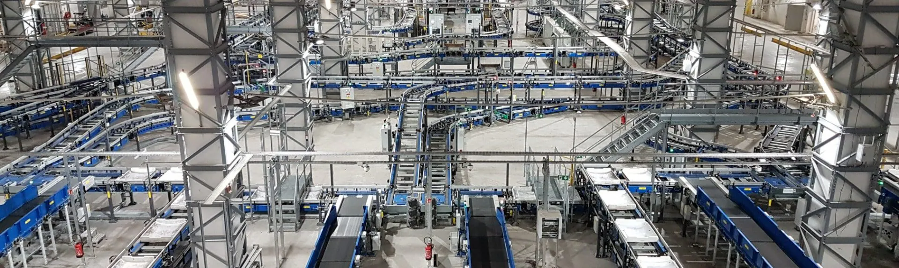

# Baggage Handling System



## Challenge Overview

Brock Solutions is a global engineering solutions and professional services company that designs, builds, and integrates large-scale automation software for transit, aviation, and industrial logistics. In any high-throughput sorting or material handling environment (such as an airport baggage handling system or a fulfillment center), multiple disciplines must converge: fast-moving mechanical transport, real-time control logic, edge sensor/vision tracking, and human-in-the-loop situational awareness dashboards.

In a real airport terminal, a baggage conveyor system is a dynamic, high-volume logistical network. Sorting thousands of bags per hour requires real-time adaptations to handle distruptions like mechanical conveyor jams, variable line speeds, routing bottlenecks, and shifting flight gates.

This challenge focuses on the workings of **Baggage Handling Systems (BHS)**. You will have the opportunity to learn about the challenges that BHS systems deal with and design a solution to address them. You can use the provided tools to develop your solution or create a completely independent solution that focuses on BHS.

---

## Industry Context

Modern industrial sortation networks are complex ecosystems responsible for moving thousands of assets per hour with zero tracking loss. To achieve this, automated systems rely on an integrated three-layer technology stack:

1. **The Physical/Sensing Layer:** Conveyor tracks, mechanical diverters, photo-eyes, laser arrays, and vision systems that transport items and capture physical operational data at high speeds.

2. **The Control Layer:** High-Level Control (HLC) brains that interpret sensor data in real time, evaluate routing choices, manage traffic density, and instantly actuate physical sorting hardware to steer items safely around system line blocks or mechanical jams.

3. **The Data & Visual Layer:** High-frequency data historians that capture continuous time-series event logs, paired with operator command-center dashboards that synthesize background telemetry into clear, actionable visual alerts and live performance metrics.

A failure or inefficiency in any single layer compromises the entire facility. This challenge provides you with the tools and environments to innovate anywhere across this stack.

---

## Potential Solutions

To jump-start your project, this repository contains some potential solutions and solution paths that you may use. You are free to modify, expand, strip down, or combine these resources as you see fit.

### 1: The SmartSort Digital Twin & Simulation Sandbox

Located in the [`bhs-simulation/`](bhs-simulation) directory, this toolset provides a fully operational software-driven simulation environment modeling a complex 28-node airport baggage handling system across a multi-phase, 3,600-tick operational stress scenario. The environment simulates real-world complexities like dynamic conveyor line traffic congestion, unexpected mechanical breakdowns (jams), and strict delivery deadlines.

* **Provided Assets:**
    * `evaluator.py`: The master simulation engine that runs the physics, tracking, and fault-injection loops of the conveyor network.
    * `solution.py`: A functional, baseline graph-routing controller to guide baggage to destination gates.
    * `bsd_dashboard.py`: A native 2D desktop application that parses simulation logs to provide smooth, tick-by-tick animated operational playbacks and interactive time scrubbing.

* **Potential Projects:**
    * **Algorithmic Pathfinding Optimization:** Replace the baseline script with a more intelligent algorithm that monitors live network telemetry to actively guide inventory around active jams and high-traffic bottlenecks to maximize on-time delivery.
    * **Dashboard UI/UX & Analytical Overhaul:** Fork the pre-built visual dashboard or build an entirely new visual stack (using React, Dash, Pygame, etc.). Design a better dashboard that enhances operator visibility, tracks key performance indicators, predicts systemic wear-and-tear, or optimizes maintenance deployment.


### 2: The Physical Vision-Guided Conveyor Testbed

Located in the [`barcode-conveyor/`](barcode-conveyor) directory, this setup offers a hands-on hardware integration experience leveraging a physical sorting platform. The workspace models an industrial inspection and routing lane using a single conveyor loop, an adjustable mechanical diverter mechanism, and an overhead camera sensor.

* **Provided Assets:**
    * An NVIDIA Jetson Nano edge computing platform connected directly to the camera and sorting actuators, capable of executing standalone Python scripts.
    * Baseline hardware interface access protocols, setup guides, and operational tutorials.

* **Potential Projects:**
    * **Computer Vision & Asset Tracking:** Develop real-time edge processing scripts on the Jetson Nano to capture video frames, isolate passing freight, and dynamically decode tracking barcodes or structural labels under varying operational speeds.
    * **Hardware-Software Coordination:** Implement precise state-tracking tracking arrays and timing loops to accurately synchronize the delay window between a camera scan event and the physical firing of the downstream diverter mechanism.
    * **Logistical Edge Networking:** Design an logging framework that cross-references scanned data against sorting manifests, tracks scanner reliability data, or pipes live field sensor events upstream to an analytical logger.

### 3: SecureBag, Luggage Visual Verification System

Located in the [securebag](securebag) directory, this system addresses a documented security vulnerability: luggage tag switching, where tags are swapped between bags to route contraband onto flights through unsuspecting passengers.

**Potential projects:**

- Add bag weight as a third verification signal
- Connect to a Raspberry Pi camera and barcode scanner to automate photo capture at each checkpoint
- Build a live alert pipeline that notifies security staff when a bag is flagged
- Extend the staff dashboard to show bag location across the handling system in real time


### 4: Custom or Hybrid Systems

Your team is welcome to step entirely outside the provided templates:

* Build hybrid systems that bridge both environments (e.g., using physical input data streams from the conveyor hardware to drive or influence variables within the broader simulated network map).
* Integrate alternative software suites, automation platforms, or protocols (such as Node-RED flow architectures, MQTT messaging brokers, or predictive maintenance databases).
* Engineer a unique Industrial Internet of Things (IIoT), supply chain, or warehouse management prototype tailored around your own vision.   

---

## Workspace Directory Structure

The repository is organized into three project directories containing the baseline solutions you can start from:

```text
baggage-handling-system/
│
├── README.md
│
└── barcode-conveyor/
│   ├── README.md
│   ├── barcode_scanner.py
│   └── Node-Red Guide.docx
│
├── bhs-simulation/
│   ├── README.md
│   ├── generate_scenario.py
│   ├── evaluator.py
│   ├── solution.py
│   ├── bsd_dashboard.py
│   └── data/
│       ├── network_layout.json
│       └── simulation_scenario.json
│
├── securebag/
│   ├── README.md
│   ├── sample_img/
│   ├── app.py
│   ├── bag_compare.py
│   └── bags.json

```
## Useful Resources

- [IATA Baggage Standards](https://www.iata.org/en/programs/ops-infra/baggage/standards/) — Includes baggage-related Resolutions and Recommended Practices, including Resolution 753 on baggage tracking and Resolution 739 on baggage security control.
- [IATA Baggage Reference Manual (BRM)](https://www.iata.org/en/publications/manuals/baggage-reference-manual/) — The primary industry manual consolidating baggage operations guidance, best practices, and the baggage Resolutions/RPs used across airlines and ground handlers.
- [IATA Baggage Information eXchange (BIX)](https://www.iata.org/en/programs/ops-infra/baggage/baggage-information-exchange-bix/) — Relevant to the data exchange and interoperability side of baggage handling systems, especially where tracking and automation are involved.
- [IATA Technical Peripheral Specifications (ITPS)](https://www.iata.org/en/publications/manuals/iata-technical-peripheral-specifications/) — Covers standard device communications for baggage-related airport systems such as baggage tag printers, self-baggage drop, and common-use devices.
- [ICAO Publications](https://www.icao.int/publications) — Useful for locating ICAO standards and guidance material that shape how airports and aviation stakeholders operate secure, interoperable systems.
- [IABSC](https://www.iabsc.org/) — Industry association content focused on baggage handling technology, system design, operations, and real-world deployment challenges.
- [SITA](https://www.sita.aero/) — Useful for understanding how airlines and airports implement baggage tracking, digital operations, and end-to-end baggage visibility.
- [ACI World](https://aci.aero/) — Provides airport operations context for how baggage systems fit into larger terminal and passenger processing environments.
