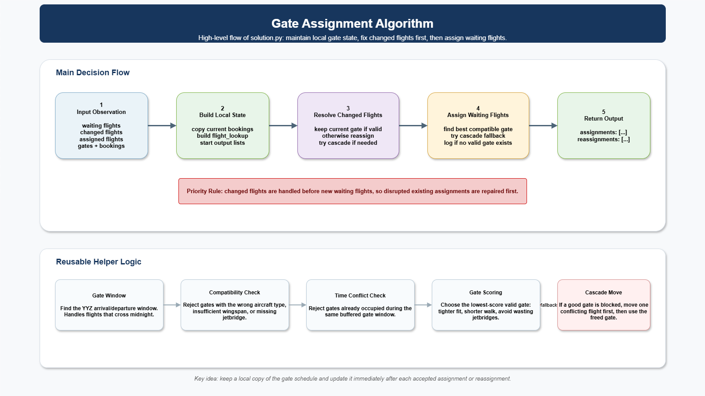

# Gate Management System

A Gate Management System (GMS) assigns arriving and departing aircraft to airport gates. It must account for aircraft size, timing, gate equipment, passenger needs, customs rules, cargo restrictions, and disruptions such as delays or outages.

At a real airport, shared flight information is stored in an Airport Operational Database. A Resource Management System uses that information to plan gates and stands, then sends changes to airlines, displays, ground handlers, and airport staff. This challenge focuses on the decision logic inside that process.

Toronto Pearson International Airport (YYZ) is the setting. A working gate-assignment algorithm is already included as a starting point, pick somewhere to take it from there.

## Table of Contents

- [Challenge](#challenge)
- [Potential Solutions](#potential-solutions)
- [Resources](#resources)

## Challenge

Do something useful with airport gate assignment. That could mean:

- improving the included algorithm
- writing a different assignment algorithm from scratch
- treating the algorithm as a given and building on top of it: a dashboard, an analysis tool, an alerting system, anything that makes the gate plan more useful to airport staff

Pick a scope you can actually finish. A few of the questions a good solution might answer:

- Can the plan handle a full day's schedule and the disruptions that land on top of it?
- Where does the current approach fall short, and what would fix it?
- Can an operator see what's happening and why, not just the raw assignments?
- Does it hold up beyond the sample scenarios?

Airports plan gates the way this challenge is structured: the full day's flight schedule is filed first, then a timeline of updates arrives at later information times.

```text
0500  planning     the full filed schedule
0900  disruption  a gate outage or aircraft swap
1000  disruption  a delay or cancellation
```

The opening planning message contains the filed schedule for the day. Later messages may report a delay, gate outage, aircraft change, cancellation, or priority diversion. An unscheduled diversion can also arrive during the day with `priority` set and need a gate immediately.

Reassignments affect passengers, ground crews, gate displays, and baggage operations, so a stable recovery is usually better than reshuffling the entire airport after every update.

If you're working on the assignment algorithm itself (improving it or replacing it), it should:

- assign every compatible flight when capacity allows
- prevent overlapping aircraft from using the same gate
- respect aircraft size, jetbridge, international, domestic, and cargo rules
- move flights away from unavailable or newly incompatible gates
- handle unassigned or malformed cases without crashing
- minimize reassignments and passenger walking distance
- work on schedules beyond the visible examples

### Input and Output

If you're writing or modifying an assignment algorithm, the evaluator calls your `decide(observation)` function at each information time. Skip this section if you're building on top of the existing algorithm instead.

The observation includes:

- current time
- gate details and outages
- waiting, assigned, and recently changed flights
- current gate occupancy
- aircraft information

Return assignments using this shape:

```python
{
    "assignments": [(flight_id, gate_id)],
    "reassignments": [(flight_id, gate_id)],
}
```

Use `assignments` for a flight receiving its first gate and `reassignments` for a flight moving from an existing gate.

### Operational Constraints

These are the rules the included algorithm already enforces. Relevant if you're changing the algorithm; background if you're building something that consumes its output.

| Constraint | Rule |
| --- | --- |
| Occupancy | Two aircraft cannot use the same gate during overlapping intervals. |
| Aircraft size | The aircraft wingspan must fit the gate. |
| Jetbridge | An aircraft requiring a jetbridge must receive a jetbridge gate. |
| International | International flights require international gates. |
| Domestic | Domestic flights may use domestic or international gates, but international gates carry a soft penalty. |
| Cargo | Cargo flights require cargo gates; passenger flights cannot use them. |
| Gate outage | A flight cannot occupy a gate while that gate is unavailable. |
| Delay | An `UpdateTiming` message can extend a flight's gate-occupancy window. |
| Changed flight | A delay or equipment change may make the current gate invalid and require repair. |
| Reassignment | Moving an already assigned flight is allowed but adds a soft-score cost. |
| Walking distance | Gate distance contributes to the soft score. |

Gate typing is asymmetric. International flights require international gates because of customs processing. Domestic flights may use domestic or international gates, although using an international gate adds a soft penalty. Cargo flights require cargo gates, and passenger flights cannot use them.

When a flight cannot be placed safely, leave it unassigned instead of returning an invalid assignment. The solution should fail gracefully instead of crashing.

## Potential Solutions

Three broad directions — improve what's here, replace it, or build on top of it. The supplied algorithms are examples, not the only acceptable approach.

| Potential solution | Description | Starting point |
| --- | --- | --- |
| Improve the scoring-aware greedy algorithm | Take the included reference algorithm further: better cost function, smarter repair on disruption, less passenger walking. | [`solution_kd.py`](solution_kd.py) |
| Build a new assignment algorithm | Write your own from scratch — e.g. a constraint solver using integer or constraint programming instead of a greedy heuristic. | [`evaluator.py`](evaluator.py) for the required interface |
| Disruption repair | Keep the existing plan stable and move only flights affected by a delay, outage, or equipment change. | [`flight_data/cascade_2.json`](flight_data/cascade_2.json) |
| Operator dashboard | Use the existing algorithm's output as a given and explain assignments, conflicts, and changes with a timeline or interactive control view. | [`visualize.py`](visualize.py) |
| Scenario analysis | Compare algorithms across busy periods, emergencies, cargo, overnight flights, and outages. | [`flight_data/`](flight_data/) |
| First-fit assignment | The minimal baseline included — read it to understand the interface before building on or replacing it. | [`solution.py`](solution.py) |



## Resources

### Industry Context

Gate management software sits inside a larger airport technology stack. An **Airport Operational Database** holds shared flight and resource information. A **Resource Management System** uses that information to assign gates and stands. Changes then flow to passenger displays, airline systems, ground handlers, and airport staff.

Real systems must also handle **Irregular Operations (IROPS)**, including delays, equipment swaps, weather, gate outages, and other events that make a static gate plan obsolete. [Brock Solutions](https://www.brocksolutions.com/airports-and-airlines/), an engineering firm headquartered in Waterloo, builds this type of airport software through its SmartSuite platform for airports including SFO, JFK, Dublin, Sydney, and Toronto Pearson. This challenge is a simplified version of the same resource-planning problem.

| Challenge concept | Industry analogue |
| --- | --- |
| Static gate data | Airport resource inventory in an RMS or AODB |
| Flight schedule JSON | AODB flight schedule data |
| Flight update messages | Live operational updates |
| Gate outage messages | Resource availability updates |
| Aircraft-gate compatibility | Stand and gate planning rules |
| Occupancy conflicts | Gate and stand collision detection |
| Delay handling | IROPS recovery |
| Reassignment cost | Operational stability and passenger experience |
| Walking distance | Passenger service optimization |
| Hidden scenarios | Robustness against operational variability |

### Getting Started

Run commands from the `gate-management-system` folder.

#### Starter Files

| Location | Purpose |
| --- | --- |
| [`solution.py`](solution.py) | A correct, minimal first-fit baseline and one possible solution interface |
| [`solution_kd.py`](solution_kd.py) | A more scoring-aware reference algorithm to study or use |
| [`evaluator.py`](evaluator.py) | Replays a scenario and checks the solution's assignments |
| [`visualize.py`](visualize.py) | Serves an interactive timeline or exports a visualization |
| [`gms/`](gms/) | The evaluator's internal domain package; participants normally do not edit it |
| [`flight_data/`](flight_data/) | Example schedules and disruption timelines |
| [`static_info.json`](static_info.json) | Gate inventory, aircraft information, and station data |
| [`JsonFlightMessageSpecification.md`](JsonFlightMessageSpecification.md) | The input message format |

#### 1. Run the Baseline

```bash
python evaluator.py --scenario flight_data/simple.json --solution solution
```

#### 2. Compare the More Optimized Example

```bash
python evaluator.py --scenario flight_data/simple.json --solution solution_kd
```

#### 3. Open the Visualizer

```bash
python visualize.py --serve
```

Open the local address printed in the terminal. On Windows, you can also double-click `launch_visualizer.bat`.

#### 4. Try Disruption Scenarios

Useful starting scenarios include:

| Scenario | What it demonstrates |
| --- | --- |
| [`simple.json`](flight_data/simple.json) | Basic placement and repeated aircraft presence |
| [`cascade_2.json`](flight_data/cascade_2.json) | A delay that forces reassignment |
| [`gate_outage.json`](flight_data/gate_outage.json) | A gate becoming unavailable |
| [`equipment_upgrade.json`](flight_data/equipment_upgrade.json) | An aircraft change that invalidates a gate |
| [`emergencies.json`](flight_data/emergencies.json) | Priority diversions arriving during the day |
| [`busy_day.json`](flight_data/busy_day.json) | A larger schedule with delays and cancellation |

Do not modify `evaluator.py` or the `gms/` package unless challenge staff asks you to. Put your decision logic in your own solution module.

### Evaluation

#### Hard Failures

A run fails when the solution produces an invalid plan, including:

- overlapping aircraft at one gate
- an aircraft that is too large for its gate
- a missing required jetbridge
- an international, domestic, passenger, or cargo gate-type violation
- an unknown or cancelled flight assignment
- invalid output format
- a changed flight left in an invalid gate

#### Soft Score

Valid runs receive a score where lower is better. The score considers:

- reassignments, especially after gate occupancy begins
- walking distance
- domestic flights using international gates
- flights left unassigned at the end

Every supplied scenario is designed to allow a solution with zero hard failures. Hidden scenarios may use different schedules and airport layouts.

### Challenge Resources

- [Flight-message specification](JsonFlightMessageSpecification.md)
- [Gate and aircraft data](static_info.json)
- [Example scenarios](flight_data/)
- [Evaluator](evaluator.py)
- [Interactive visualizer](visualize.py)

### Industry and Safety References

- [IATA Airport Handling Manual](https://www.iata.org/en/publications/manuals/ground-operations/): the industry reference for ground-handling policy and procedures
- [IATA Ground Operations Manual](https://www.iata.org/en/publications/manuals/iata-ground-operations-manual/): standard procedures for gate, ramp, and jetbridge work
- [IATA Safety Audit for Ground Operations](https://www.iata.org/en/programs/ops-infra/ground-operations/isago): the safety-audit framework used by ground-service providers
- [ICAO Annex 14: Aerodromes](https://store.icao.int/en/annex-14-aerodromes): international context for aerodrome, apron, and stand design
- [ICAO aerodrome safety information](https://www.icao.int/safety/Pages/default.aspx)